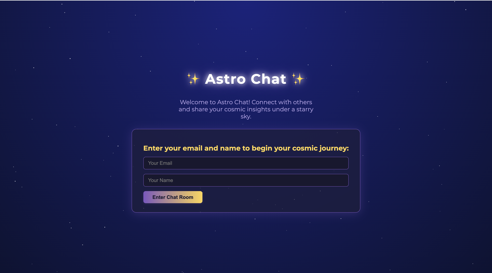
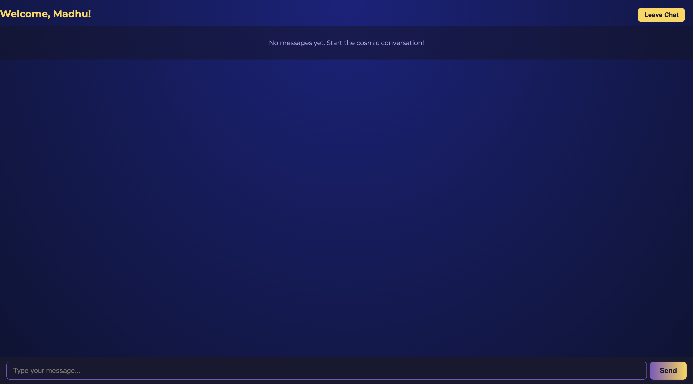
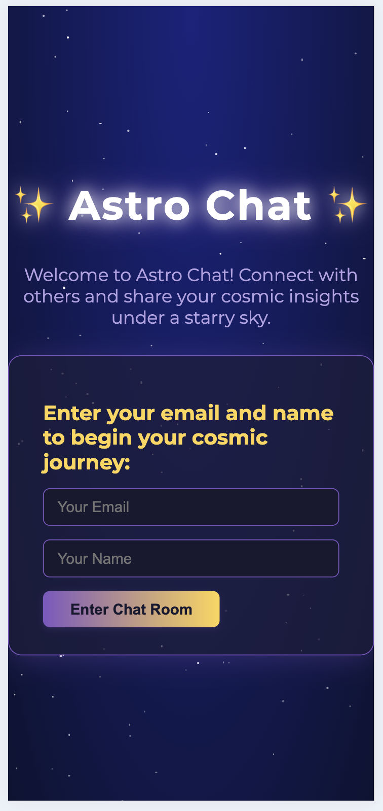
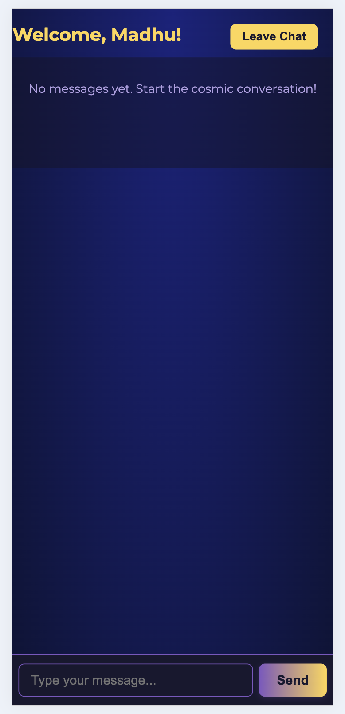

## 👋 Welcome to Astro Chat Discussions!

Astro Chat is a cosmic-themed chat platform powered by OpenAI, designed for meaningful conversations and sharing insights under a virtual starry sky. This Discussions space is where our community can connect, collaborate, and help each other grow.

### What can you do here?
- **Ask questions** about using or developing Astro Chat.
- **Share your ideas** for new features, improvements, or integrations.
- **Showcase your projects** or customizations built on top of Astro Chat.
- **Report issues** or get help with setup, deployment, or usage.
- **Engage with other cosmic explorers** and help build a friendly, open-minded community.

### How to get started?
- Introduce yourself below! Tell us what brings you to Astro Chat and what you hope to achieve.
- If you’re new, check out our [README]([./README.md](./README.md)) for setup and usage instructions.
- If you have a question or suggestion, start a new discussion or join an existing one.

---

✨ **Let’s make Astro Chat a welcoming place for everyone interested in AI-powered chat and cosmic conversations!** ✨
```

Madhu-RK: Create ReadMe for this project.
Use emogies and more attractive for users

GitHub Copilot: ```markdown
# ✨ Astro Chat ✨

Welcome to **Astro Chat** – your cosmic chat platform powered by OpenAI!  
Connect, converse, and share your insights under a virtual starry sky. 🚀🌌

---

## 🌟 Features

- **AI-Powered Chat**: Chat with AstroBot, your friendly AI companion (powered by OpenAI).
- **Real-Time Messaging**: Instant messaging with a beautiful, animated starry background.
- **Cosmic Community**: Connect with others, share ideas, and explore the universe of conversation.
- **Conversation History**: Your chats are saved and can be revisited anytime.
- **Secure & Private**: User data is stored securely in MongoDB, and sensitive keys are never exposed to the frontend.

---

## 🚀 Getting Started

### 1. **Clone the Repo**
```bash
git clone https://github.com/your-username/astro-chat.git
cd astro-chat
```

### 2. **Setup Environment Variables**

Create a `.env` file in the `backend/` folder:
```
MONGO_URI=your_mongodb_connection_string
OPENAI_API_KEY=your_openai_api_key
```

Create a `.env.local` file in the `frontend/` folder (for frontend secrets if needed):
```
# No secrets needed for frontend by default
```

### 3. **Install Dependencies**

**Backend:**
```bash
cd backend
npm install
```

**Frontend:**
```bash
cd ../frontend
npm install
```

### 4. **Run the App**

**Start Backend:**
```bash
cd backend
npm start
```

**Start Frontend:**
```bash
cd ../frontend
npm run dev
```

Visit [http://localhost:3000](http://localhost:3000) to start your cosmic journey! 🌠

---

## 🛠️ Tech Stack

- **Frontend:** Next.js, React, TypeScript, CSS Modules
- **Backend:** Node.js, Express, MongoDB, Socket.io
- **AI:** OpenAI GPT (ChatGPT API)

---

## 💡 Usage

1. Enter your email and name to begin your cosmic journey.
2. Chat with AstroBot or other users in real time.
3. Your conversations are saved and can be revisited anytime.
4. When you leave or close the chat, your entire conversation is stored securely.

---

## 🤝 Community & Contributions

- Start a [Discussion](https://github.com/madhu619/astro-chat/discussions) to ask questions or share ideas!
- Found a bug or want to suggest a feature? [Open an Issue](https://github.com/madhu619/astro-chat/issues).
- PRs are welcome! Please read our [CONTRIBUTING.md](CONTRIBUTING.md) before submitting.

---

## 🌌 Screenshots






---

## 📜 License

MIT License

---

## ✨ Enjoy your cosmic conversations with Astro Chat! ✨
